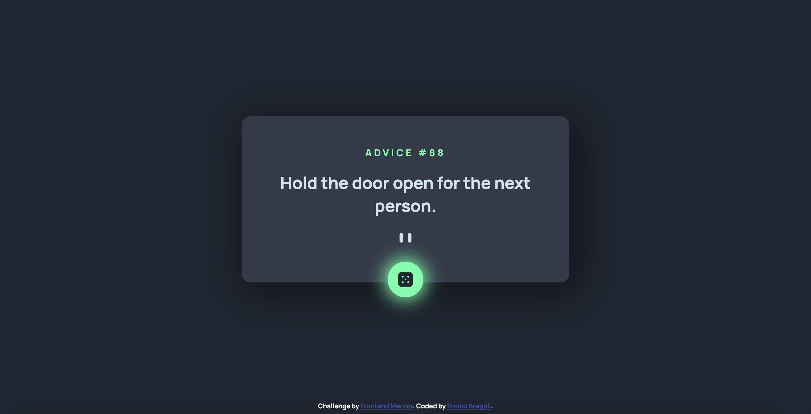

# Frontend Mentor - Advice generator app solution

This is a solution to the [Advice generator app challenge on Frontend Mentor](https://www.frontendmentor.io/challenges/advice-generator-app-QdUG-13db).

## Table of contents

- [Overview](#overview)
  - [Advice Generator App](#The-challenge)
  - [Screenshot](#screenshot)
  - [Links](#links)
- [Useful resources](#useful-resources)
- [Author](#author)

## Overview

### The challenge

Users should be able to:

- View the optimal layout for the app depending on their device's screen size
- See hover states for all interactive elements on the page
- Generate a new piece of advice by clicking the dice icon

### Screenshot

### Links

- Solution URL: (https://github.com/EnricoBreg/Advice_Generator_App.git)
- Live Site URL: (https://62617c45634cc30cd9345a29--graceful-otter-855220.netlify.app/)

### Built with

- Semantic HTML5 markup
- CSS custom properties
- Flexbox
- Javascript Vanilla (XMLHttpRequest or Fetch API)

## Useful resources

- [AJAX Crash Course (Vanilla JavaScript)](https://www.youtube.com/watch?v=82hnvUYY6QA) - This helped me for XMLHttpRequest in Vanilla Javascript. I really liked this video and Brad Traversy is one of my mentor :).
- [Fetch API Introduction](https://www.youtube.com/watch?v=Oive66jrwBs) - Another video of Traversy Media that helped me understand what is Fetch API and how it works. Very Simple and Clear.

## Author

- Website - [Enrico Bregoli](https://www.your-site.com)
- Frontend Mentor - [@EnricoBreg](https://www.frontendmentor.io/profile/EnricoBreg)
- LinkedIn - [Enrico Bregoli](https://www.linkedin.com/in/enrico-bregoli/)
